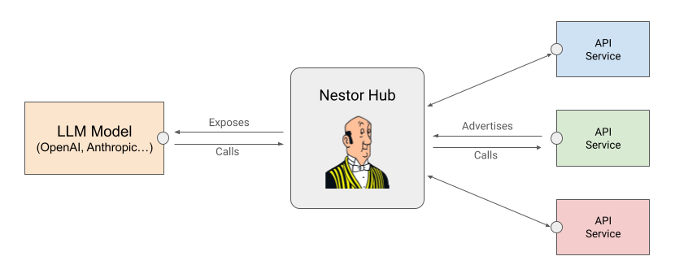

# Nestor - An API Hub for AI Agents

Nestor is an API hub designed to empower AI agents with the ability to discover, aggregate, and utilize various API services available on the local network. By providing a unified interface for AI models to access a wide range of services, Nestor enables the creation of ubiquitous AI agents that can spontaneously interact with their environment and automate tasks.

## Key Features

* Service Discovery: Nestor automatically detects and aggregates Nestor-compatible API services on the local network, making them accessible to connected AI agents.
* Execution Orchestration: Nestor acts as a single point of contact for these API services, orchestrating function calls requested by the LLM model

## High-Level Architecture

A typical Nestor architecture comprises of:

- A Hub that acts as the collector and orchestrator of all Nestor services
- A number of Nestor services. They can be embedded in existing software or be built as independent software who act as a proxy to other API services
- A number of Nestor clients: typically LLM-Based AI Agents that are going to expose to the LLM model all the API visible from the Hub



## Getting Started

The simplest way to get started is to see Nestor in action using the example services and clients available in [nestor-examples](https://github.com/nbonamy/nestor-examples). You can watch a [demo video](https://youtu.be/qPjsabr4dfo) of Nestor.

You will need four different terminal windows:

1. In `nestor`, go to the `hub` directory then run
```
npm install
npm start
```

2. In `nestor-examples`, go to the `service1` directory then run
```
npm install
npm start
```

  You should see the Hub acknowledging the discovery of 2 new endpoints

3. In `nestor-examples`, go to the `service2` directory then run
```
npm install
npm start
```

  You should see the Hub acknowledging the discovery of 3 new endpoints

4. In `nestor-examples`, go to the `client` directory then run
```
npm install
OPENAI_API_KEY=xxxx npm start
```

Replace `xxx` with your OpenAI API Key.

The client is going to access the hub and expose the 5 enpoints to the LLM. You should see each service being called and the AI agent in action to create a playlist of the songs played at The National concert (this is of course a fake setlist). A more detailed description of what is going on is avaiable in the `nestor-examples` [README.md](https://github.com/nbonamy/nestor-examples/blob/main/README.md).

## Running the hub

Simply clone the repo, go to the `hub` folder and start it.

A `pm2` ecosystem file is provided if you want to run it that way. Just use `npm run pm2`.

The hub automatically broadcasts its presence on the network to be discoverable by services and clients.

## Service implementation

Implementing a service is pretty straightforward:
- Add `@nestor/service` as a new dependency
- Import/require NestorService in your application
- Instantiate a new NestorService instance by prodiving:
  - A unique name for your service
  - The port number your service runs on
  - The URL path that lists all the API of your service
- Start the service: it should auto-discover the hub and register to it

The URL path that lists all API should return a list of API, each described by:

| Attribute | Type | Description |
|-----------|------|-------------|
| `description` | string | The description of your API as it will be provided to the LLM. Remember that the LLM decision to call or not your API will be based on that description!|
| `url` | string | The full URL of your API including host and port. See the examples how to automatically build this from Express Request object|
| `parameters` | Array | List of parameters required to call your API. Check table below for the parameters attributes|

Each parameter is described by:

| Attribute | Type | Description |
|-----------|------|-------------|
| `name` | string | Name of the parameter |
| `type` | string | Types supported are defined by the LLM engine |
| `description` | string | The description of the parameter as it will be provided to the LLM. Remember that the LLM decision how to use the parameter will be based on that description!|
| `required` | boolean | If this paramter is mandatory or not|

## Client implementation

Implementing a client is even more straightforward if you already have a LLM-based agent. If not the implementation available in `nestor-examples` is pretty generic (except for the hard-coded prompt) and could be reused almost as-is:

- Add `@nestor/client` as a new dependency
- Import/require NestorClient in your application
- Instantiate a new NestorClient
- Provide the result of NestorClient.list() to the LLM call

## TODO

- [ ] Error handling (everywhere)
- [ ] Tests!
- [ ] Publish @nestor/* packages
- [ ] Support more HTTP verbs for API calls

## Suggestions

Nestor is in its early stage and all suggestions are welcome!
